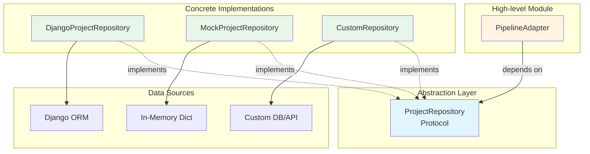

# Pipeline Adapter Abstraction Layer

## Overview

The Pipeline Adapter has been refactored to use a repository abstraction layer, removing direct Django ORM coupling from the adapter's public interface. This design follows the **Dependency Inversion Principle** and allows the adapter to work in non-Django contexts.

## Architecture

### Dependency Flow



**Key Points:**
- PipelineAdapter depends on abstraction (Protocol), not concrete implementations
- Multiple implementations can exist without changing PipelineAdapter
- Follows Dependency Inversion Principle

### Before (Coupled to Django)

```python
# Direct Django imports at module level
from backend.projects.models import Project
from backend.repos.models import RepositoryInstallation

class PipelineAdapter:
    def discover(self):
        # Direct ORM usage
        projects = Project.objects.all()
        ...
```

**Problems:**
- Cannot use adapter outside Django context
- Cannot test adapter without full Django setup
- Violates adapter pattern principles
- Hard to mock for unit tests

### After (Decoupled via Abstraction)

```python
from .repositories import ProjectRepository, DjangoProjectRepository

class PipelineAdapter:
    def __init__(self, project_root: str, repository: Optional[ProjectRepository] = None):
        self._repository = repository or DjangoProjectRepository()

    def discover(self):
        # Uses abstraction
        projects = self._repository.get_all_projects()
        ...
```

**Benefits:**
- Adapter works with any repository implementation
- Easy to test with `MockProjectRepository`
- Follows SOLID principles
- Django imports only in implementation, not interface

## Repository Abstraction

### `ProjectRepository` Protocol

Defines the contract for data access:

```python
@runtime_checkable
class ProjectRepository(Protocol):
    def get_all_projects(self) -> List[Dict[str, Any]]: ...
    def get_project_by_id(self, project_id: str) -> Optional[Dict[str, Any]]: ...
    def find_project(self, slug: str) -> Optional[Dict[str, Any]]: ...
    def get_repository(self, repo_id: int) -> Optional[Dict[str, Any]]: ...
    def get_repository_installation(self, repo_id: int) -> Optional[Dict[str, Any]]: ...
    def get_latest_pipeline_execution(self, project_id: str) -> Optional[Dict[str, Any]]: ...
```

### `DjangoProjectRepository` Implementation

Production implementation using Django ORM:

```python
class DjangoProjectRepository:
    def __init__(self):
        from backend.projects.models import Project
        from backend.repos.models import Repository, RepositoryInstallation
        from backend.pipelines.models import PipelineExecution

        self._Project = Project
        self._Repository = Repository
        # ... store model references

    def get_all_projects(self) -> List[Dict[str, Any]]:
        projects = self._Project.objects.all()
        return [self._project_to_dict(p) for p in projects]
```

**Key Features:**
- Imports Django models only in `__init__`
- Converts Django models to plain dictionaries
- Keeps `_instance` reference for internal use
- Fails gracefully if Django not available

### `MockProjectRepository` Implementation

Test implementation without Django:

```python
class MockProjectRepository:
    def __init__(self):
        self._projects: List[Dict[str, Any]] = []

    def add_project(self, project: Dict[str, Any]) -> None:
        self._projects.append(project)

    def get_all_projects(self) -> List[Dict[str, Any]]:
        return self._projects.copy()
```

**Use Cases:**
- Unit testing without Django
- Integration testing
- Non-Django environments
- Development and debugging

## Usage Examples

### Default Usage (Django)

```python
from systemeval.adapters.pipeline_adapter import PipelineAdapter

# Automatically creates DjangoProjectRepository
adapter = PipelineAdapter('/path/to/backend')
tests = adapter.discover()
result = adapter.execute(tests)
```

### Testing with Mock Repository

```python
from systemeval.adapters import MockProjectRepository, PipelineAdapter

# Create mock repository
repo = MockProjectRepository()
repo.add_project({
    'id': '1',
    'name': 'Test Project',
    'slug': 'test-project',
    'repo_url': 'https://github.com/test/repo'
})

# Inject mock repository
adapter = PipelineAdapter('/fake/path', repository=repo)
tests = adapter.discover()
# Tests discovered without Django!
```

### Custom Repository Implementation

```python
class PostgresProjectRepository:
    """Custom implementation using psycopg2 directly"""
    def __init__(self, connection_string: str):
        self.conn = psycopg2.connect(connection_string)

    def get_all_projects(self) -> List[Dict[str, Any]]:
        cursor = self.conn.cursor()
        cursor.execute("SELECT id, name, slug FROM projects")
        return [{'id': row[0], 'name': row[1], 'slug': row[2]} for row in cursor]

# Use custom repository
repo = PostgresProjectRepository('postgresql://...')
adapter = PipelineAdapter('/path', repository=repo)
```

## Design Decisions

### 1. Protocol vs Abstract Base Class

**Choice:** Protocol (PEP 544)

**Rationale:**
- Duck typing allows any object with matching methods
- No inheritance required
- More flexible for testing
- Runtime checkable with `@runtime_checkable`

### 2. Dictionary Return Types vs Model Objects

**Choice:** Dictionary return types

**Rationale:**
- Framework-agnostic
- Easy to serialize
- No Django model coupling
- Can include `_instance` for internal use

### 3. Abstraction Boundary

**Choice:** Public interface only (discover, execute, validate_environment)

**Rationale:**
- Private helpers (`_poll_for_completion`, `_collect_metrics`) use Django directly
- These methods perform complex ORM queries
- Abstracting these would duplicate Django ORM functionality
- Keeps abstraction focused and practical

### 4. Backward Compatibility

**Choice:** Auto-create DjangoProjectRepository if no repository provided

**Rationale:**
- Existing code continues to work
- No breaking changes
- Opt-in for testing scenarios

## Testing Strategy

### Unit Tests (No Django Required)

```python
def test_pipeline_adapter_discovery():
    repo = MockProjectRepository()
    repo.add_project({'id': '1', 'name': 'Test', 'slug': 'test'})

    adapter = PipelineAdapter('/fake', repository=repo)
    tests = adapter.discover()

    assert len(tests) == 1
    assert tests[0].name == 'Test'
```

### Integration Tests (With Django)

```python
def test_pipeline_adapter_with_django(django_db):
    # Use real Django repository
    adapter = PipelineAdapter('/path/to/backend')
    tests = adapter.discover()

    # Tests actual database queries
    assert len(tests) > 0
```

### Mocking in Tests

```python
def test_execute_with_mock():
    repo = MockProjectRepository()
    repo.add_project({'id': '1', 'name': 'Test', 'slug': 'test'})

    adapter = PipelineAdapter('/fake', repository=repo)

    # Execute will fail gracefully with mock
    result = adapter.execute(verbose=False)
    assert result.errors == 1
    assert 'Mock repository does not support' in result.failures[0].message
```

## Migration Guide

### For Existing Code

No changes required! Existing code continues to work:

```python
# This still works exactly as before
adapter = PipelineAdapter('/path/to/backend')
```

### For New Code (Testing)

Use dependency injection for better testability:

```python
# In production code
def create_adapter(config):
    if config.use_mock:
        repo = MockProjectRepository()
        # ... populate mock data
    else:
        repo = DjangoProjectRepository()

    return PipelineAdapter(config.project_root, repository=repo)
```

### For Custom Implementations

Implement the `ProjectRepository` protocol:

```python
class MyCustomRepository:
    def get_all_projects(self) -> List[Dict[str, Any]]:
        # Your implementation
        pass

    # ... implement other methods

adapter = PipelineAdapter('/path', repository=MyCustomRepository())
```

## Benefits Achieved

1. **Framework Independence**: Adapter can work without Django
2. **Testability**: Easy to test with mock repositories
3. **Flexibility**: Support for alternative data sources
4. **SOLID Principles**: Dependency Inversion Principle
5. **Maintainability**: Clear separation of concerns
6. **Documentation**: Protocol defines clear contract

## Future Enhancements

Potential future improvements:

1. **Read-Only vs Read-Write Repositories**: Split protocol for query vs mutation operations
2. **Async Support**: Add async versions of repository methods
3. **Caching Layer**: Implement caching repository wrapper
4. **Metrics Repository**: Separate abstraction for metrics collection
5. **Repository Factory**: Factory pattern for creating repositories based on config

## References

- **Dependency Inversion Principle**: SOLID principles
- **Repository Pattern**: Martin Fowler's P of EAA
- **PEP 544**: Protocol definition for Python
- **Adapter Pattern**: GoF Design Patterns

## See Also

- `/systemeval/adapters/repositories.py` - Repository implementations
- `/systemeval/adapters/pipeline_adapter.py` - Pipeline adapter using repositories
- `/examples/test_pipeline_abstraction.py` - Working example demonstrating abstraction
